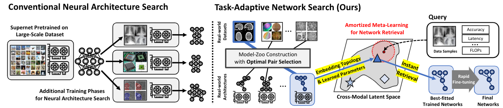

# NeurIPS 2021 (Spotlight): Task-Adaptive Neural Network Search with Meta-Contrastive Learning

This is an official PyTorch implementation of [Task-Adaptive Neural Network Search with Meta-Contrastive Learning](https://arxiv.org/abs/2103.01495). Accepted to NeurIPS 2021 (**Spotlight**). 

```
@inproceedings{jeong2021task,
    title     = {Task-Adaptive Neural Network Search with Meta-Contrastive Learning},
    author    = {Jeong, Wonyong and Lee, Hayeon and Park, Geon and Hyung, Eunyoung and Baek, Jinheon and Hwang, Sung Ju},
    booktitle = {Advances in Neural Information Processing Systems (NeurIPS)},
    year      = {2021}
} 
```

## Overview



Most conventional Neural Architecture Search (NAS) approaches are limited in that they only generate architectures without searching for the optimal parameters. While some NAS methods handle this issue by utilizing a supernet trained on a large-scale dataset such as ImageNet, they may be suboptimal if the target tasks are highly dissimilar from the dataset the supernet is trained on. To address such limitations, we introduce a novel problem of Neural Network Search (NNS), whose goal is to search for the optimal pretrained network for a novel dataset and constraints (e.g. number of parameters), from a model zoo. Then, we propose a novel framework to tackle the problem, namely Task-Adaptive Neural Network Search (TANS). Given a model-zoo that consists of network pretrained on diverse datasets, we use a novel amortized meta-learning framework to learn a cross-modal latent space with contrastive loss, to maximize the similarity between a dataset and a high-performing network on it, and minimize the similarity between irrelevant dataset-network pairs. We validate the effectiveness and efficiency of our method on ten real-world datasets, against existing NAS/AutoML baselines. The results show that our method instantly retrieves networks that outperform models obtained with the baselines with significantly fewer training steps to reach the target performance, thus minimizing the total cost of obtaining a task-optimal network. 

## Prerequisites
- Python 3.8 (Anaconda)
- PyTorch 1.8.1
- CUDA 10.2


## Environmental Setup

Please install packages thorugh `requirements.txt` after creating your own environment with python 3.8.x.
```
$ conda create --name ENV_NAME python=3.8
$ conda activate ENV_NAME
$ conda install pytorch==1.8.1 torchvision cudatoolkit=10.2 -c pytorch
$ pip install --upgrade pip
$ pip install -r requirements.txt
```

## Preparation 
We provide our model-zoo consisting of 14K pretrained models on various Kaggle datasets. We also share the full raw datasets collected from Kaggle as well as their processed versions of datasets for meta-training and meta-test in our learning framework. Except for the raw datasets, all the processed files are required to perform the cross model retrieval learning and meta-testing on unseen datasets. Please download following files before training or testing. (Due to the heavy file size, some files will be updated by Oct. 28th. Sorry for the inconvenience). 


|No.|File Name  | Description                         | Extension | Size   | Download |
|---|-----------|-------------------------------------|-----------|--------|----------|
|1  |p_mod_zoo  | Processed 14K Model-Zoo             | pt        | 91.9MB | [Link](https://www.dropbox.com/s/gb0xe86zulsjs99/p_mod_zoo.pt?dl=0)       |
|2  |ofa_nets   | Pretrained OFA Supernets            | tar.gz    | 9.69GB | [Link](https://www.dropbox.com/s/t5evknimeu0y22z/ofa_nets.tar.gz?dl=0)    |
|3  |raw_m_train| Raw Meta-Training Datasets          | tar.gz    | 23.23GB| [Link](https://www.dropbox.com/s/mvkyb7qsdmx5cud/raw_m_train.tar.gz?dl=0) |
|4  |raw_m_test | Raw Meta-Test Datasets              | tar.gz    | 0.89GB | [Link](https://www.dropbox.com/s/jaiq173z0fruzw4/raw_m_test.tar.gz?dl=0)  |
|5  |p_m_train  | Processed Meta-Training Files       | pt        | 69MB   | [Link](https://www.dropbox.com/s/1qbsgjqanxgw2ji/p_m_train.pt?dl=0)       |
|6  |p_m_test   | Processed Meta-Test Files           | zip       | 11.6GB | [Link](https://www.dropbox.com/s/gl02dis7q5lswpb/p_m_test.zip?dl=0)       |


After download, specify their location on following arguments:

- `data-path`: 5 and 6 should be placed. 6 must be unzipped. 
- `model-zoo`: path where 1 should be located. Please give full path to the file. i.e. path/to/p_mod_zoo.pt
- `model-zoo-raw`: path where 2 should be placed and unzipped (required for meta-test experiments)


## Learning the Cross Modal Retrieval Space

Please use following command to learn the cross modal space. Keep in mind that correct `model-zoo` and `data-path` are required. For`base-path`, this path is for storing training outcomes, such as resutls, logs, the cross modal embeddings, etc. 

``` bash
$ python3 main.py --gpu $1 \
                  --mode train \
                  --batch-size 140 \
                  --n-epochs 10000 \
                  --base-path path/for/storing/outcomes/\
                  --data-path path/to/processed/dataset/is/stored/\
                  --model-zoo path/to/model_zoo.pt\
                  --seed 777 
```
You can also simply run a script file after updating the paths.
``` bash
$ cd scripts
$ sh train.sh GPU_NO
```

## Meta-Test Experiment

You can use following command for testing the cross-modal retrieval performance on unseen meta-test datasets. In this experiment, `load-path` which is the base-path of the cross modal space that you previously built and `model-zoo-raw` which is path for the OFA supernets pretrained on meta-training datasets are required. 

``` bash
$ python3 ../main.py --gpu $1 \
                     --mode test \
                     --n-retrievals 10\
                     --n-eps-finetuning 50\
                     --batch-size 32\
                     --load-path path/to/outcomes/stored/\
                     --data-path path/to/processed/dataset/is/stored/\
                     --model-zoo path/to/model_zoo.pt\
                     --model-zoo-raw path/to/pretrained/ofa/models/\
                     --base-path path/for/storing/outcomes/\
                     --seed 777
```
You can also simply run a script file after updating the paths.

``` bash
$ cd scripts
$ sh test.sh GPU_NO
```


